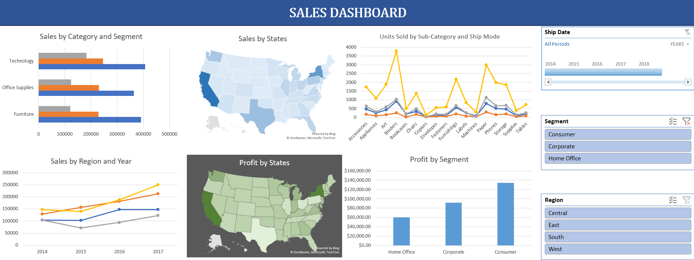

# 📊 Sales Dashboard (Excel)

## 🚀 Project Overview
This project is an **interactive Sales Dashboard built in Microsoft Excel** to analyze and visualize sales performance across multiple dimensions such as category, segment, state, and region. It leverages **pivot tables, slicers, and charts** to create a dynamic and user-friendly reporting solution.  

The dashboard provides actionable insights on:
- Sales trends by **year, region, and category**
- Profit breakdown by **segment and state**
- Units sold by **sub-category and shipping mode**
- State-wise sales and profit performance using **map visualizations**

---

## 🔑 Key Features
- 📂 **Sales by Category & Segment** – Compare performance of Technology, Furniture, and Office Supplies across Consumer, Corporate, and Home Office segments.  
- 🌎 **Sales & Profit by States** – Geographic heatmaps for quick state-level insights.  
- 📈 **Sales by Region and Year** – Trend analysis across Central, East, South, and West regions.  
- 📦 **Units Sold by Sub-Category & Ship Mode** – Detailed breakdown of product performance.  
- 🔍 **Interactive Filters (Slicers)** – Analyze data by year, region, and customer segment seamlessly.  

---

## 🛠️ Tools & Skills Used
- **Microsoft Excel**  
- **Pivot Tables** for aggregating data  
- **Pivot Charts** for interactive visualizations  
- **Slicers & Timeline** for filtering and drill-down analysis  
- **Conditional Formatting & Map Charts** for geographic insights  

---

## 🎯 Purpose
The goal of this project is to showcase **data analysis and visualization skills** using Excel. The dashboard can be used by sales teams, managers, or analysts to quickly identify sales performance trends and make data-driven business decisions.  

---

## 📌 How to Use
1. Download the Excel file from this repository.  
2. Open it in **Microsoft Excel (2016 or later)**.  
3. Use slicers and timeline to interact with the dashboard and analyze different dimensions of sales data.  

---

## 🤝 Contributions
This project is open for suggestions and improvements. Feel free to fork, raise issues, or contribute enhancements.  

---

✨ *If you like this project, don’t forget to star ⭐ the repo!*  
